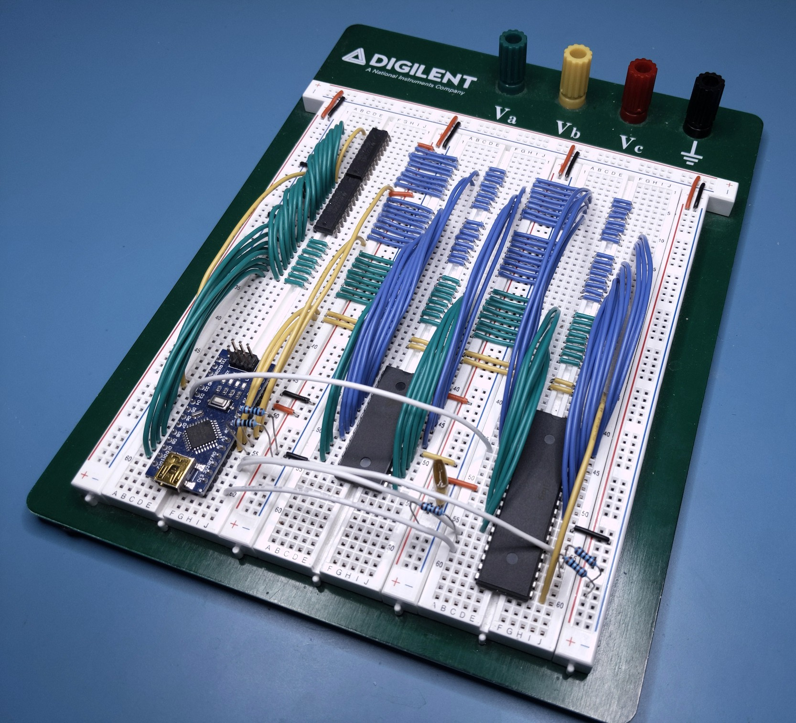

# Arduino Z80 Monitor

- Uses Arduino Nano/Uno, two 74HC573 latches, parallel SRAM, and Z80 CPU
- Built-in assembler, disassembler, and memory monitor
- Import and export memory in IHX format

Check out these YouTube videos!

- [Coding and breadboarding tutorial]()



## Assembling the circuit


## Building the software

Use the [PlatformIO](https://platformio.org/) plugin for [VSCode](https://code.visualstudio.com/).

Open the project folder with VSCode, select the environment for your board (`uno`, `nano`, `oldnano`), and click `Upload`.


The [core](https://github.com/trevor-makes/core) library is required and PlatformIO will download this into the `.pio` folder.

Distributed under the [MIT license](LICENSE.txt)

## Using the built-in commands

After building and uploading the program to the Arduino, connect a serial monitor such as the one included with PlatformIO. A `>` should appear as a prompt for input. For commands taking integer parameters, values may be specified as decimal `255`, hex `$FF`, octal `&377`, or binary `%11111111`. The following commands are available:

```
>baud [rate]
```

The baud rate defaults to 9600, but can be changed at runtime. Type `ctrl-t` `b` `[rate]` in the PlatformIO terminal to match the changed baud rate. Setting the baud rate too high can cause IHX import to fail if it exceeds the EEPROM page write timing. Tested with 115200 and found to be within a safe margin.

### Assembler commands

TODO

### Memory monitor commands

```
>hex [base] [size]
```

Prints a hex dump of ROM data from `base` to `base + size - 1`.

```
>set [base] "string pattern"
```

Writes ASCII data to memory starting at `base`. No null terminator is written.

```
>set [base] "string pattern" 0
```

Writes ASCII data followed by a null terminator (or any other byte).

```
>set [base] $41 255 %01000001 'A' "strings too"
```

Writes byte or ASCII data sequentially to memory starting at `base`.

```
>fill [base] [size] [pattern]
```

Repeats one-byte `pattern` in memory from `base` to `base + size - 1`.

```
>move [source] [size] [dest]
```

Copies memory from [`source`...`source + size - 1`] to [`dest`...`dest + size - 1`]. Destination may overlap with source.

### Transferring data in IHX format

Data is transferred in plain text [Intel HEX](https://en.wikipedia.org/wiki/Intel_HEX) format. Use the [bin2ihx](scripts/bin2ihx.py) script to convert from a binary file or the [ihx2bin](scripts/ihx2bin.py) script to do the reverse.

The plain text data may be copy/pasted into the host terminal or uploaded with a special terminal command. The PlatformIO terminal supports uploading with the `ctrl-t` `ctrl-u` [escape sequence](https://docs.platformio.org/en/latest/core/userguide/device/cmd_monitor.html#examples).

```
>import
```

All input following the command will be parsed as Intel HEX and written to memory.

```
>verify
```

All input following the command will be parsed as Intel HEX and validated against values read from memory. Prints "PASS" on success. Prints "FAIL" and marks differences with '*' otherwise.

```
>export [base] [size]
```

Prints memory from `base` to `base + size - 1` in Intel HEX format.

## Example Z80 programs

### Add two bytes

Add byte at `$100` to byte at `$101` and store result at `$102`

```
LD HL,$0100
LD A,(HL)
INC HL
ADD A,(HL)
INC HL
LD (HL),A
HALT
```

Copy-paste to import machine code:

```
import
:090000002100017E23862377769E
:00000001FF
set $100 $12 $34
run
hex $100
```

Prints `0100  12 34 46 ...`

### Rot13 string cypher

Equivalent C code

```
for (char *ptr = 0x100; *ptr != 0; ++ptr) {
  if (*ptr > 'z') {
    continue;
  } else if (*ptr >= 'n') {
    *ptr -= 13;
  } else if (*ptr >= 'a') {
    *ptr += 13;
  } else if (*ptr > 'Z') {
    continue;
  } else if (*ptr >= 'N') {
    *ptr -= 13;
  } else if (*ptr >= 'A') {
    *ptr += 13;
  }
}
```

Z80 assembly listing

```
 // for (char *ptr = 0x100; ...; ...)
 LD HL,$FF // following INC makes $100
next:
 // for (...; ...; ++ptr)
 INC HL
 // for (...; *ptr != 0; ...)
 LD A,0
 CP A,(HL)
 JR NZ,body
 HALT
body:
 // if ('z' < *ptr) continue;
 LD A,'z'
 CP A,(HL)
 JR C,next
 // if (*ptr >= 'n') { *ptr -= 13; continue; }
 LD A,(HL)
 CP A,'n'
 JR C,skip1
 SUB A,13
 LD (HL),A
 JR next
skip1:
 // if (*ptr >= 'a') { *ptr += 13; continue; }
 CP A,'a'
 JR C,skip2
 ADD A,13
 LD (HL),A
 JR next
skip2:
 // if ('Z' < *ptr) continue;
 LD A,'Z'
 CP A,(HL)
 JR C,next
 // if (*ptr >= 'N') { *ptr -= 13; continue; }
 LD A,(HL)
 CP A,'N'
 JR C,skip3
 SUB A,13
 LD (HL),A
 JR next
skip3:
 // if (*ptr >= 'A') { *ptr += 13; continue; }
 CP A,'A'
 JR C,next
 ADD A,13
 LD (HL),A
 JR next
```

Copy-paste to import machine code and decypher message:

```
import
:2000000021FF00233E00BE2001763E7ABE38F47EFE6E3805D60D7718EAFE613805C60D77FF
:1A00200018E13E5ABE38DC7EFE4E3805D60D7718D2FE4138CEC60D7718C9A8
:00000001FF
set $100 "Lbh'er njrfbzr!" 0
run
hex $100
```

Copy-paste to disassemble imported machine code:

```
label next $0003
label body $000A
label skip1 $0019
label skip2 $0022
label skip3 $0031
dasm 0 $3a
```
